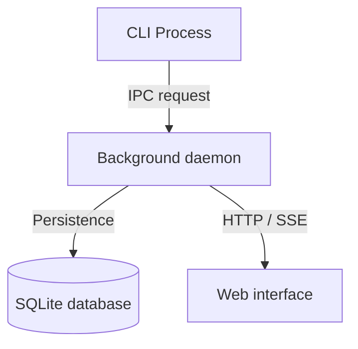

## Overview

DevTools provides unified developer workflows, an embedded loopback daemon, and web dashboard utilities across CLI and browser interfaces.

## System architecture

```mermaid
flowchart TD
  CLI["CLI Process"] -->|"IPC request"| Daemon["Background daemon"]
  Daemon -->|"Persistence"| SQLite[("SQLite database")]
  Daemon -->|"HTTP / SSE"| Web["Web interface"]
```
